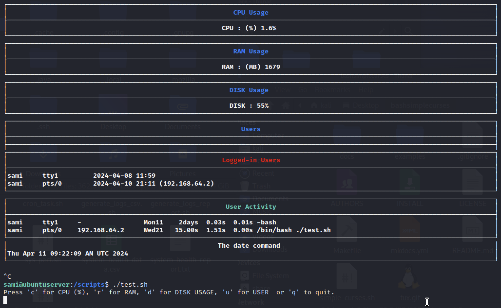

# El-Doctor

#### BeCode Project for Logs generation / automation


### Usage of Bash Simple Curses

Link : <a href="https://github.com/metal3d/bashsimplecurses" target="_blank">https://github.com/metal3d/bashsimplecurses</a>



```python
# Open /scripts directory
cd /scripts

# Execute the file to see the prompt management using BashSimpleCurse
./bashsimplecurses.sh

# Navigate and Enjoy it !
```
### Usage (Manually)

```python
# Open /scripts directory
cd /scripts

# Generate and Update a CSV file that contains info's about the System Health Status.
./generate_logs_csv.sh 

# Generate a Log file that contains info's about the System Health Status.
./sys_perf.sh 

# Generate a Weekly Log Report file that contains info's about the System Health Status History
./weekly_log_report.sh 

# Generate a .txt Report file that contains info's about the System Health Status and display them.
./generate_logs_report.sh 

# Send an Alert (mail) only if a service reach a defined level.
./alert_status.sh 

```

### Usage (Automatically)

#### Use CRON
```
# Open your CRON Tasks file
crontask -e
```


```
# ADD your CRON TASKS (Should be updated based on :
# Your Schedule AND Your Script Direcctory on your server)

# m h  dom mon dow   command
0 * * * * /scripts/generate_logs_report.sh
0 * * * * /scripts/alert_status.sh
0 3 * * 0 /scripts/generate_logs_report.sh
0 * * * * /scripts/sys_perf.sh
0 8 * * 0 /scripts/weekly_log_report.sh
```

## Contributing

Pull requests are welcome. For major changes, please open an issue first
to discuss what you would like to change.

## License

[MIT](https://choosealicense.com/licenses/mit/)